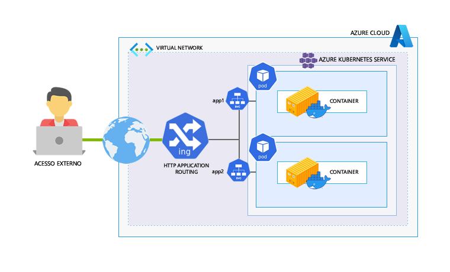

# [Case] Usando HTTP App Routing como Ingress Controller em Ambientes ñ-Produtivos

**Objetivo**: Criar e configurar o AKS para ambiente não produtivo usando o HTTP Application Routing como Ingress Controller para acesso externo da aplicação.

**Tecnologias envolvidas**: Azure Kubernetes Service, Ingress Controller HTTP Application Routing.

