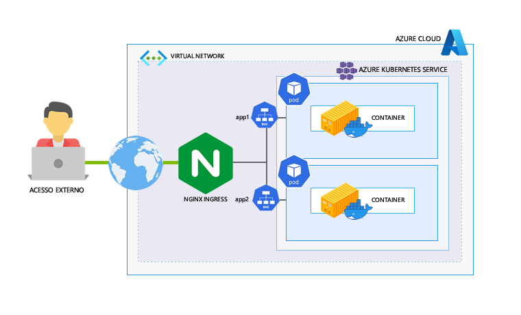

# [Case] Usando NGINX como Ingress Controller de Múltiplos Apps

**Objetivo**: Criar e configurar o AKS para ambiente produtivo usando o NGINX como Ingress Controller para acesso externo da aplicação.

**Tecnologias envolvidas** : NGINX, Azure Kubernetes Service.

