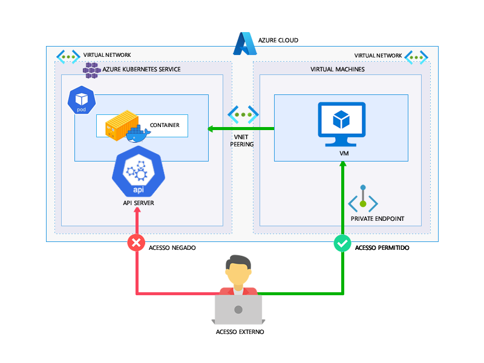

# [Case] Usando Azure Virtual Network no AKS em Modo 

## Privado
**Objetivo**: Provisionar o AKS com acesso apenas privado. Para acessar o Kubernetes API Server e, por exemplo, fazer deploy de manifesto YAML usaremos uma VM com VNET Peering entre as redes virtuais.

**Tecnologias Envolvidas**: Virtual Network Peering, Virtual Machine, Private Endpoint, Azure Kubernetes Service

