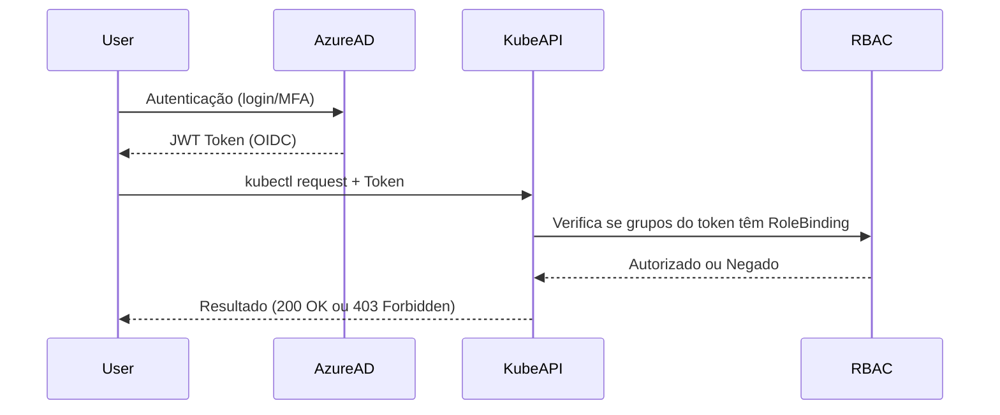

# Azure AD no AKS

O AKS não tem um banco próprio de usuários. Ele delega a autenticação para o Azure AD (Entra ID).
Ou seja, quem valida quem você é → Azure AD
quem valida o que você pode fazer → RBAC do Kubernetes.

1. Autenticação – Azure AD como porteiro

Referência: https://learn.microsoft.com/pt-br/azure/aks/azure-ad-rbac?tabs=portal


```sh
az aks get-credentials --resource-group meuRG --name meuCluster
kubectl get pods -n dev

```


O fluxo é:

O kubectl pede credenciais → ele chama o az (CLI do Azure).

O az abre um fluxo de autenticação com o Azure AD (se não houver token válido).

O Azure AD valida quem você é (MFA, senha, certificado, etc.).

O Azure AD emite um JWT/OIDC token com claims do usuário (ou grupo).

Esse token vai para o kube-apiserver.


2. Autorização – RBAC do Kubernetes

O kube-apiserver:

Lê o token do Azure AD.

Vê os grupos (groups claim) ou o usuário (upn claim).

Confere no RBAC (Role/ClusterRole + Bindings) se esse grupo/usuário tem permissão.

👉 Exemplo:
Se no token vem o claim groups=aks-dev-readers, e no cluster existe um RoleBinding ligando aks-dev-readers ao Role pod-reader, o usuário consegue listar pods.


3. Onde entra a “mão” do AD

Identidade dos usuários → gerenciada no Azure AD.

Grupos → criados e mantidos no Azure AD (aks-dev-readers, aks-sre-admins).

Object ID dos grupos → usados nos RoleBinding do AKS.

MFA, políticas de acesso condicional, identity protection → tudo controlado pelo Azure AD.
(o cluster em si nem sabe de MFA, ele só confia no token emitido pelo AD).


4. Exemplo prático de Binding com Grupo AD

```yaml
    apiVersion: rbac.authorization.k8s.io/v1
    kind: RoleBinding
    metadata:
    name: dev-readers-binding
    namespace: dev
    subjects:
    - kind: Group
    name: "d4f9a2ab-12cd-43f9-9bdf-b8f998b74a12"  # Object ID do grupo no Entra ID
    apiGroup: rbac.authorization.k8s.io
    roleRef:
    kind: Role
    name: pod-reader
    apiGroup: rbac.authorization.k8s.io

```


Resumindo:


